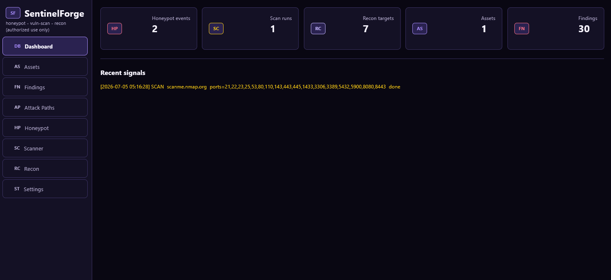

# SentinelForge

SentinelForge is a local defensive security evidence-correlation and attack-path analysis toolkit for home labs and small environments.

It normalizes findings from service scanning, vulnerability intelligence, passive reconnaissance, web audits, control gaps, and honeypot telemetry into an evidence graph. SentinelForge uses that graph to rank explainable attack paths, retain supporting and contradictory evidence, and produce analyst-friendly reports.

The project is pre-release. Its current focus is improving correlation logic, evidence confidence, path explainability, and false-positive suppression—not replacing mature scanners such as Nmap.



## Features

- TCP/UDP service scanning with socket or optional Nmap engine
- Passive recon for DNS, WHOIS/RDAP, subdomains, web tech hints, and safe endpoint checks
- Low-interaction HTTP, SSH, FTP, Telnet, and SMTP honeypots
- Local vulnerability cache imports for NVD/generic JSON, CISA KEV, EPSS CSV, exploit CSV, and vendor/distribution advisories
- Findings, assets, scan history, and multi-format exports
- Flet desktop UI and basic CLI

## Install

```powershell
python -m venv .venv
.\.venv\Scripts\python -m pip install -e ".[dev]"
```

Optional packet tooling is intentionally separate:

```powershell
.\.venv\Scripts\python -m pip install -e ".[packet]"
```

## Run UI

```powershell
sentinelforge-ui
```

or:

```powershell
python main.py
```

## CLI

```powershell
sentinelforge scan 127.0.0.1 --ports 22,80,443
sentinelforge recon example.com
sentinelforge export --format html
sentinelforge attack-paths
sentinelforge doctor
sentinelforge validate-feed epss_csv data/epss.csv
sentinelforge sync-vulns --validate-only
sentinelforge cleanup
```

## Health Checks

Run `doctor` before opening an issue or enabling optional engines:

```powershell
sentinelforge doctor
```

It checks Python, SQLite, DB integrity, WAL mode, optional tools, package imports, scanner policy, local counts, and vulnerability source quality.

## Stress Testing

SentinelForge includes local synthetic stress data tools for validating report, graph, attack path, and honeypot-campaign performance without scanning real systems.

```powershell
sentinelforge stress-seed --assets 5000 --findings-per-asset 3 --honeypot-events 100000 --recon-targets 1000
sentinelforge stress-benchmark --report-format json
sentinelforge stress-clear
```

`stress-clear` removes only synthetic records created with the SentinelForge stress prefix.

## Optional Engines

Nmap is used automatically when installed and the scanner engine is set to `auto` or `nmap`. Extra Nmap flags can be configured, but SentinelForge owns output and target flags internally.

Nikto can be enabled as an optional web audit engine. SentinelForge stores Nikto output as supporting evidence that should be manually validated before treating it as confirmed.

Packet tooling is optional:

```powershell
python -m pip install -e ".[packet]"
```

PyShark/Wireshark/TShark support is currently marked WIP.

## Scope Controls

Public targets are blocked by default. Configure scanner scope before scanning external assets.

Supported scanner settings:

- `target_allowlist`: list of wildcard patterns
- `scope_file_path`: path to a text file with one hostname/IP/wildcard per line
- `block_public_targets`: default `true`
- `block_private_targets`: default `false`

Example scope file:

```text
127.0.0.1
*.internal.example
10.0.0.*
```

## Vulnerability Feeds

Use Settings or CLI validation before importing:

```powershell
sentinelforge validate-feed nvd_json C:\feeds\nvd
sentinelforge validate-feed vendor_advisory_json C:\feeds\ubuntu-osv.json
```

The importer supports official and generic shapes for JSON and CSV feeds. The Settings page shows accepted rows and minimum fields.

## Development

```powershell
python -m pytest -q
python -m compileall -q sentinelforge tests
ruff check .
```

Tests isolate runtime data through `SF_DATA_DIR`.

## Status

This project is pre-release. Review scope controls and local laws before using it outside a lab.
